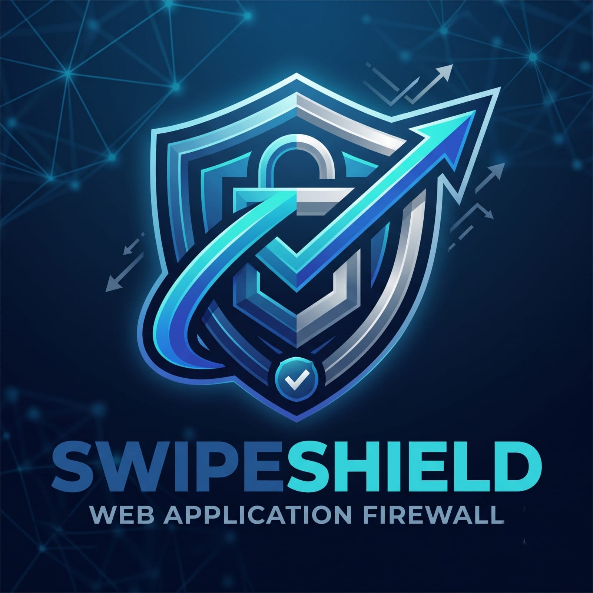

# SwipeShield

<p align="center">
  
</p>

**A self-hostable, protocol-aware Web Application & API Protection (WAAP)
gateway.**

SwipeShield inspects application-layer traffic — REST, GraphQL, gRPC,
WebSocket, and SSE — against layered defenses: a ModSecurity-style rule
engine, distributed-safe rate limits, bot detection with proof-of-work
challenges, TLS fingerprinting, and optional ML / LLM-protection and WASM
plugin modules. It runs as a reverse proxy, or as an Envoy `ext_proc` sidecar
in a service mesh.

> **Read `docs/threat-model.md` before deploying.** It states exactly what we
> protect against — and what we do not.

## Architecture

```
                         ┌────────────────────────────────────────────┐
  Client ──TLS 1.3──▶   │              SwipeShield                    │
  (h1 / h2 / h3)         │                                            │
                         │  listeners  ──▶  host/site routing         │
                         │                                            │
                         │  inspection pipeline (per request):        │
                         │    rules (CRS) · rate limit · bot score    │
                         │    fingerprint · parsers (gql/grpc/ws/sse) │
                         │    WASM plugins · ML · LLM protection      │
                         │            │  verdict: allow|block|challenge│
                         │            ▼                              │
                         │        reverse proxy  ──▶  origin app      │
                         │            │                               │
                         │        events pipeline (log / webhook)     │
                         └────────────────────────────────────────────┘

  Optional deployment modes:
    • Envoy ext_proc sidecar  → core/eval runs in the mesh data plane
    • eBPF pre-filter         → kernel-adjacent, off by default
```

## What this is / isn't

**It is** an application-layer WAF/WAAP for API-first backends, with
first-class GraphQL, gRPC, and WebSocket protection, explainable verdicts,
and a strict "every outbound call is time-bounded and has a fail mode" rule.

**It is not** a network firewall, a volumetric-DDoS scrubber, a CDN edge, a
DLP tool, or a replacement for application authorization and business-logic
validation. See the full does-not-protect matrix in
`docs/threat-model.md`.

## Protocol coverage

| Protocol | Inspection | Enforcement |
|----------|-----------|-------------|
| HTTP/1.1, HTTP/2, HTTP/3 | rules, rate limit, bot score, fingerprint, WASM, ML, LLM | 400 / 403 / 413 / 429 / 500, PoW challenge |
| GraphQL | depth, complexity, alias count, introspection, batching | 400 / 403 |
| gRPC | protobuf field parsing, service/method rules | 403 |
| WebSocket | per-message inspection, message-size and rate limits | 1008 policy close |
| SSE | stream-level inspection | 403 |

## Quickstart (fresh clone → protected demo app)

Requires Docker and Go 1.25+.

```sh
git clone https://github.com/swipeshield/swipeshield
cd swipeshield

# Build the waf + demo images, bring the stack up, and run the smoke suite
./scripts/smoke-test.sh --build
```

`smoke-test.sh` builds the compose stack (`docker-compose.yml`: the `waf`
gateway plus `test/demoapp`, a reference backend with REST, GraphQL, and
WebSocket endpoints), waits for the gateway healthcheck, runs 12 checks
(REST benign + SQLi/XSS blocks, GraphQL depth/batching/introspection,
bot challenge, WebSocket echo + malicious-message block), then tears down.

Or manually:

```sh
docker compose up -d --build
# REST
curl -s -H 'Host: localhost' http://127.0.0.1:8080/api/hello
curl -s -o /dev/null -w '%{http_code}\n' -H 'Host: localhost' \
  "http://127.0.0.1:8080/api/echo?q=1'%20OR%201=1--"     # -> 403
# GraphQL
curl -s -H 'Host: localhost' -H 'Content-Type: application/json' \
  -X POST http://127.0.0.1:8080/graphql \
  -d '{"query":"{__schema{types{name}}}"}'                 # -> 403 (introspection)
```

The demo stack listens on `127.0.0.1:8080` only. To expose it beyond localhost,
read the config walkthrough below and `docs/threat-model.md` §7 first.

## Configuration

Configuration is a single JSON/YAML file — see `config.example.json` (full
surface) and `deploy/compose/config.json` (quickstart). Highlights:

- `sites[]`: host-based virtual sites; each has its own backend, CRS toggles,
  rate limits, bot thresholds, GraphQL/WebSocket limits, and fail mode.
- `listeners[]`: multiple HTTP / HTTPS (TLS 1.3) / HTTP/3 (QUIC) listeners.
- `ml.*` / `llm_protection.*`: optional ML payload classification and LLM-route
  protection, each with an explicit `fail_mode`.
- `plugins.*`: WASM plugin directory, execution timeout, and memory ceiling.
- `envoy.listen`: when set, exposes the decision engine as an Envoy
  `ext_proc` gRPC sidecar.
- `events.*`: JSONL event log and webhook delivery with per-attempt timeouts.

## Envoy sidecar mode

Run the same decision engine inside a service mesh:

```sh
cd core
go build ./cmd/swipeshield
swipeshield -config /path/to/config.json   # with "envoy": {"listen": ":9100"}
```

Reference Envoy/Istio configs in `deploy/envoy/` (`ext_proc.yaml`,
`istio-sidecar.yaml`).

## WASM plugins

Plugins run in a sandboxed `wazero` host with a minimal host interface (read
request metadata, return a verdict + score), a host-enforced execution timeout,
and a memory ceiling. No raw filesystem or network access is exposed. See
`wasm-plugins-examples/` and the WASM plugin author section of
`CONTRIBUTING.md`.

## Development

See `CONTRIBUTING.md` for ground rules (RE2-only regex, time-bounded external
calls, no secrets in code, tests before merge).

```sh
cd core
go vet ./... && go test -race ./...
go build ./cmd/swipeshield
```

CI runs build, vet, `go test -race`, gitleaks (secret scan), and govulncheck
(dependency scan) on every PR.

## Roadmap

Tracked in `docs/PHASES.md`. v0.1.0 completes the first end-to-end milestone:
reverse proxy + rule engine through to a fully verified compose quickstart.

## License

Apache-2.0. See `LICENSE`.
